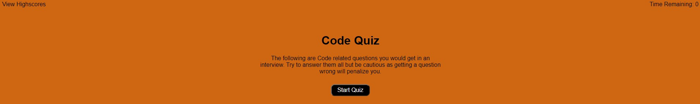
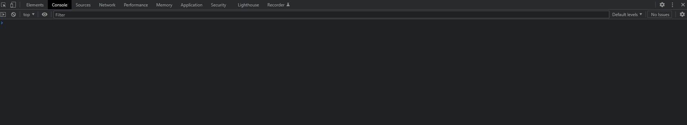
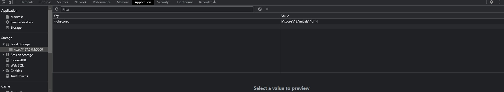

# Code Quiz

## Description
The following App was built to function as a generic Code Quiz. It was built with only a few questions to test your basic Javascript knowledge. If you answer wrong you will have time deducted from your score but this will also create a scoreboard with a list of Highscores so you can keep aiming to get them all right.

Link to my Code Quiz: https://dfaidley23.github.io/Code-Quiz/

## Table of Contents

- [Usage](#usage)
- [Credits](#credits)
- [Tests](#tests)

## Usage
In order to use the app you simply need to press the "Start Quiz" button. You will then have a timer start counting in the top right of the website. Once this reaches 0 you will fail if you haven't finished your test. If you do finish the timer will stop to show you the time it took to complete the quiz along with a score based on your questions answered correctly.

Website:
    

## Credits
Credits for the help during this project go to the follwoing:
- http://mcqspdfs.blogspot.com/2013/08/60-top-javascript-multiple-choice.html
- My Tutor
- The DU Staff
- W3 Schools
- MDN
- Stackoverflow
- https://simplestepscode.com/javascript-quiz-tutorial/

## How to Contribute
If you would like to contribute to this app feel free to send me and email or pull my code and feel free to mess with it to show me where I could have improved the functionality of this app.

## Tests
If you would like to test for any erros just inspect the webpage and go to both console "for errors with my JS" or to the application page to see if the relevent data is stored in local storage.

Console View:
    

Scores in local storage:
    